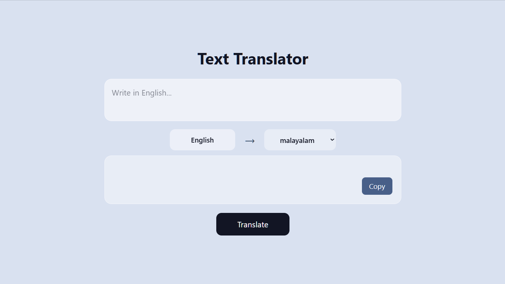

# Text Translator using React, Tailwind & RapidAPI

🌐 Live Demo: https://translator-one-psi.vercel.app/

## Project Overview

This project was developed as a part of the Front-End Development Internship conducted by QSkill and SR India Pvt.Ltd.

The main purpose of this project is to demonstrate the implementation of a multilingual text translation application using React, Axios, and RapidAPI. The application allows users to enter text in English and translate it into different languages such as Malayalam, Hindi, German, and French through an external translation API.

## Features

- Translate English text into  languages like Malayalam, Hindi, German, French.
- Clean and responsive user interface.
- API integration using RapidAPI.
- Copy translated text functionality.

## Technologies Used

- React.js
- Vite
- JavaScript
- Tailwind CSS
- Axios
- RapidAPI
- HTML
- CSS

## Screenshot

## Learning Outcomes

-learned how to build a user interface using Tailwind CSS directly inside React rather than writting separately in css files.

-Gained an idea about how to use Third Party API's using RapidAPI.

-Learned how to make API request and handle responses using Axioms.

-Got more knowlege about how to build a user friendly interface.

## Difficulties Faced

-Intitially the interface was larger than the screen size,which caused scrolling

-The translated text were large and overflowing the output box.

-The translation API was challenging as the text was not getting translated to desired language.

-The translation process was slow and taking few seconds to display the translated text.

### Author

Elsi C Pate, 
BTech Computer Science
